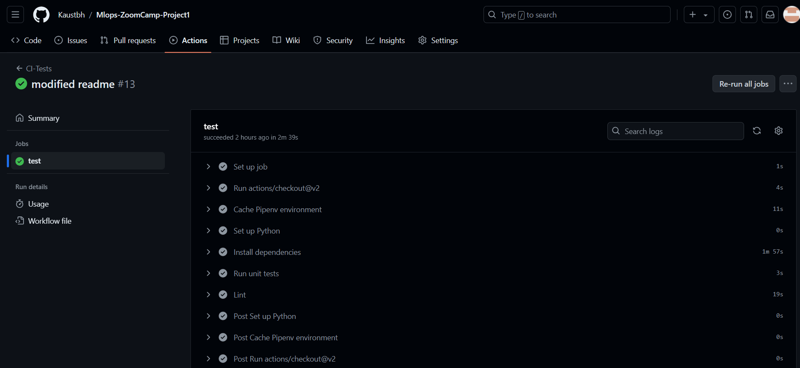

*The CI workflow is designed to maintain high code quality by automatically running tests and enforcing coding standards. It is triggered by specific events and provides immediate feedback to developers, helping them catch issues early in the development process.*

## Workflow Triggers

The CI workflow is activated in the following scenarios:

- Pull Requests: Automatically runs when a pull request is opened, synchronized, or reopened for any branch with a name starting with dev. This ensures that code changes are validated before being merged into a development branch.

- Pushes to Main: Automatically runs when changes are pushed directly to the main branch. This helps maintain the stability of the main codebase.

The CI workflow consists of several key components, each serving a specific purpose to ensure code quality and reliability:

### 1. Checkout Code
The first step in the workflow is to checkout the latest version of the code from the repository. This ensures that the workflow operates on the most recent changes.

### 2. Cache Dependencies
Caching is used to speed up the installation of dependencies. By caching the Pipenv environment, subsequent workflow runs can reuse previously installed packages, reducing execution time and improving efficiency.

### 3. Set Up Python Environment
The Python environment is configured to match the project's requirements. This includes specifying the Python version and setting up any necessary environment variables.

### 4. Install Dependencies
All project dependencies are installed using Pipenv. This ensures that the environment is correctly configured with all the libraries required for testing and linting.

### 5. Run Unit Tests
Unit tests are executed using Pytest to validate the functionality of the codebase. This step helps identify and fix bugs before the code is merged, ensuring that changes do not break existing functionality.

- Continue on Error: The workflow is configured to continue running even if some tests fail. This allows developers to see all test failures at once, facilitating comprehensive debugging.

### 6. Code Linting
Pylint is used to analyze the code for style and syntax errors. Linting helps enforce coding standards and catch potential issues, improving code readability and maintainability.

- Linting Tolerance: The workflow tolerates linting warnings but highlights critical issues that must be addressed before merging.

### 1. GitHub Actions - Workflow Execution:

  
