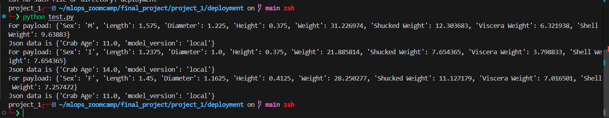
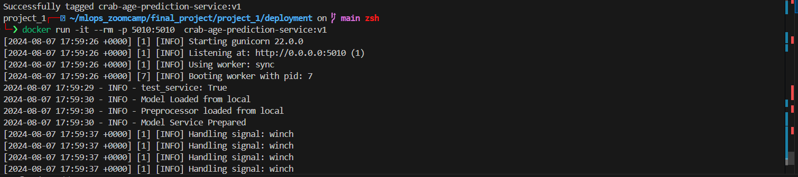

For [model deployment](./deployment), the ML model has been deployed as a Flask Web service and then deployed into a Docker container for production.

## In this folder we have 4 python files `model_loader.py` and `model_service.py` for loading the model and for making predictions, `app.py` and `test.py` for Flask Web Service and for sending POST requests.

1. Firstly we run the Docker container which has the Flask app `./deployment/app.py` to launch the Flask Web service inside Docker. 

  

2. We finally run the `./deployment/test.py` testing script which sends a POST request, including the features, to the Flask Web service in the container, and then receives back a crab age prediction.

  

 
