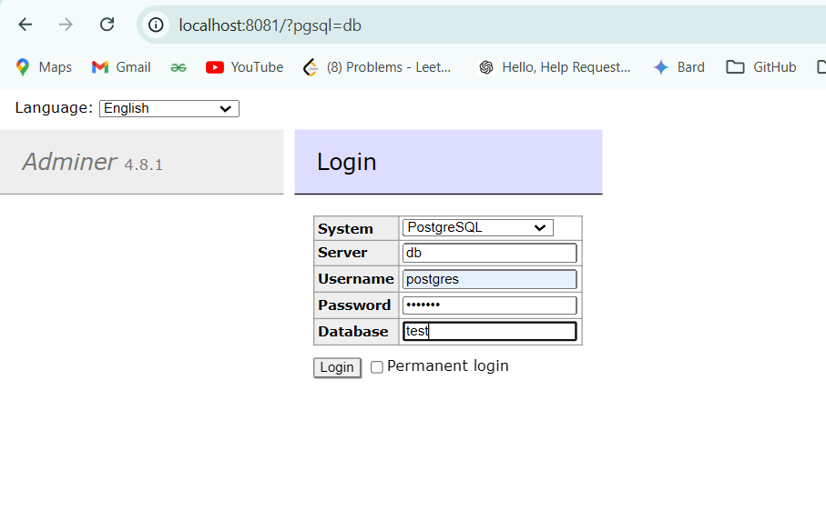
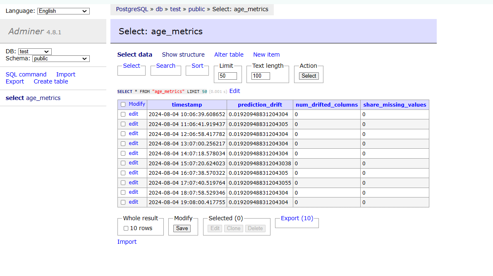
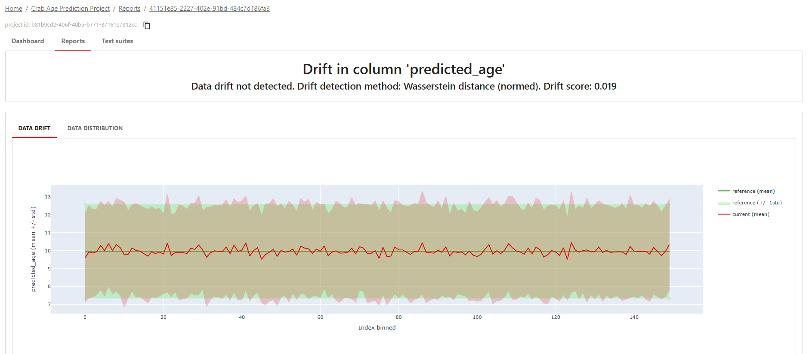
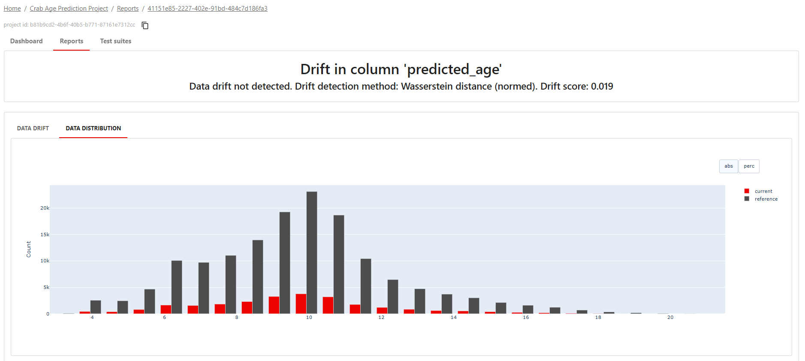
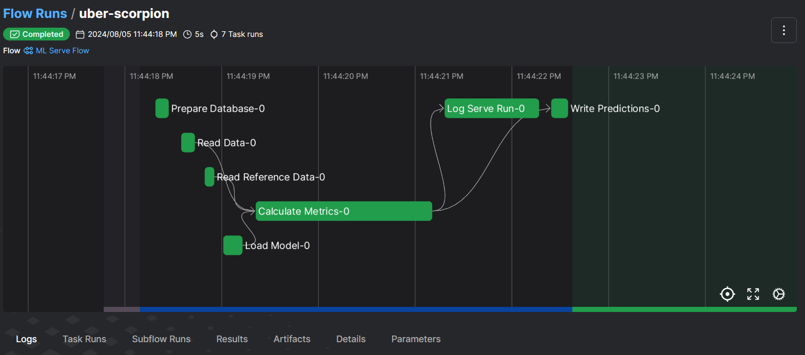

# Model Monitoring

## Model Monitoring service

Monitoring component consists of

- **Postgresql Database** to store the prediction log
- **Adminer** tools to interact with the database
- **Monitoring service**
- **Evidently dashboard** to check the data drift visually

All services from above will be run from docker compose.

#### Adminer tool

#### Prediction log inside the database

## Evidently Dashboard

The report about data drift and target drift can be checked from **evidently dashboard**.

#### Evidently dashboard
 

 

## Monitoring Pipeline

The **monitoring pipeline** can be deployed as a workflow by using **prefect**. With prefect, the workflow can be scheduled and triggered via API.

#### Monitoring Pipeline with prefect Example
 

