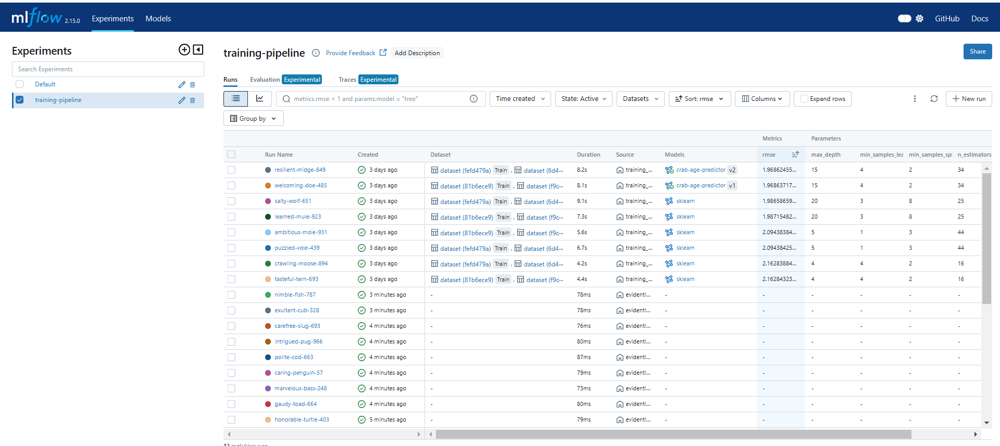
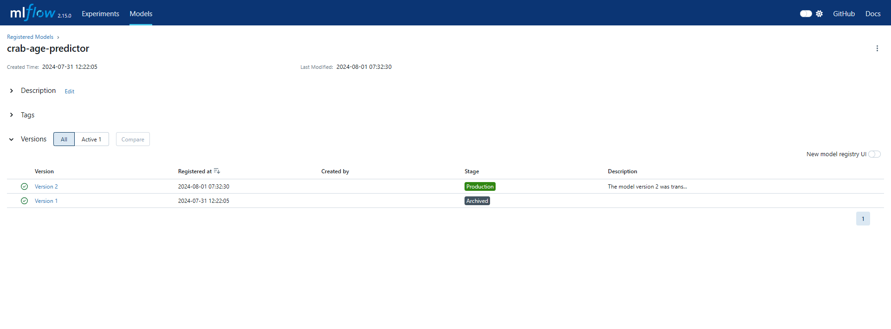
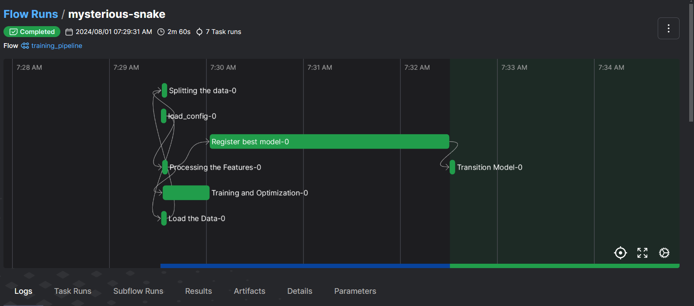

## Training Pipeline

The training pipeline consists of the following steps.

1. Load configuration from *config.yaml*
2. Load the data from local
3. Splitting the data into train, test and valid.
4. Processing the features
5. Hyperparameter tuning with **optuna** library to find the best parameters of **RandomForestRegressor** model to find the best model.
6. After that, it will search the best model that has the lowest **rmse** from the experiments. If there is no registered model in the model registry, the best model will be transitioned into the **production stage**. If there is already a production model in the model registry, the **best model** from the **recent experiments** and the production model will be compared which one has got less **rmse**. If the best model from recent experiment has more **rmse**, it will be updated as the **production** model.

For loading the data, the data can be loaded from the local. Loading the data from local is easier one for now because there is no need to export the aws credentials.

#### Experiment Tracking example
 

#### Model Registry example
 

**Warning:** If you choose to use the data loading with s3 and if you don't set the environment variables associated with aws credentials, you will get the error. For loading data from local, there is no need to set the environment variables.

## Deploying the training pipeline with prefect

This training workflow can be deployed with the **prefect** service. With prefect, the workflow can be scheduled and triggered via API. Deployment name is **deploy_train** and work pool name is **train-pool**

#### Prefect Workflow for training pipeline example
 

